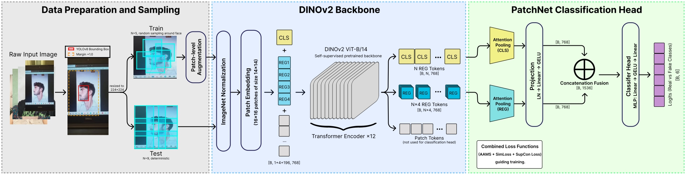

# FindIT 2026 — Data Analytics Competition (DAC)

## 🏆 Result

| Metric | Score |
|---|---|
| Public Score | 0.9577 |
| Private Score | 0.9717 |
| Overall Ranking | **1st Place** |

## 📋 Overview

Seiring dengan pesatnya perkembangan teknologi, sistem *face recognition* telah banyak diterapkan di berbagai sektor, seperti pembukaan kunci perangkat seluler, sistem absensi, hingga verifikasi identitas pada layanan keuangan. Meskipun memberikan kemudahan dan efisiensi, sistem ini masih memiliki kerentanan terhadap ancaman keamanan, salah satunya adalah **face spoofing**.

Face spoofing merupakan bentuk serangan yang bertujuan untuk mengelabui sistem pengenalan wajah dengan memanfaatkan media visual, seperti foto cetak, tampilan gambar pada layar, maupun representasi wajah lainnya.

**Task:** Mengembangkan model computer vision berbasis citra (*image-based*) yang mampu mengklasifikasikan wajah ke dalam **6 kelas** secara akurat:

| Kelas | Deskripsi |
|---|---|
| `realperson` | Wajah asli manusia (448 gambar) |
| `fake_unknown` | Serangan jenis tidak diketahui (352 gambar) |
| `fake_mask` | Serangan topeng 3D (278 gambar) |
| `fake_mannequin` | Serangan manekin (232 gambar) |
| `fake_screen` | Serangan layar digital (206 gambar) |
| `fake_printed` | Serangan foto cetak (143 gambar) |

**Evaluation:** Macro F1-Score (rata-rata F1-Score dari setiap kelas).

## 🧠 Approach


*Gambar 1. Gambaran Umum Pipeline TREX*

Solusi pipeline ini, kami beri nama **TREX (Triple-Component Register Encoder
eXtractor)** yang dibangun meninggalkan pendekatan konvensional dan mengadopsi paradigma *Vision Foundation Models* yang dipadukan dengan optimalisasi matematis tingkat lanjut, dengan 4 pilar utama:

### 1. Data Purification — Offline Face Cropping (YOLOv8-Face)
- Deteksi dan cropping wajah secara *offline* menggunakan **YOLOv8-Face**
- **Auto-Rotation (4 skenario):** Mendeteksi orientasi gambar terbaik (0°, 90°, 180°, 270°) berdasarkan *confidence* tertinggi
- **Margin Cropping 30%:** Menyertakan konteks tepi wajah untuk menangkap artefak seperti tepian topeng atau kertas

### 2. Anti-Spoofing Specific Augmentations (Albumentations)
Pipeline augmentasi 3 lapis yang mensimulasikan kondisi *spoofing* nyata:
- **Level 1 (Spasial):** `ShiftScaleRotate`, `HorizontalFlip` — invariansi posisi dan orientasi
- **Level 2 (Simulasi Serangan):** `GridDistortion`/`OpticalDistortion` (Moiré layar), `ImageCompression`/`Downscale` (artefak cetak), `GaussNoise`/`ISONoise` (noise sensor), `GaussianBlur`/`Sharpen` (defocus)
- **Level 3 (Pencahayaan):** `ColorJitter`, `HueSaturationValue`, `RandomShadow` — variasi glare dan bayangan

### 3. Custom Patch Sampler Dataset
- Alih-alih meresize seluruh gambar, model disuapi **patch 224×224px** yang diekstrak dari resolusi asli untuk mempertahankan detail tekstur Moiré dan pikselasi
- Mode *train*: Random crop patches; Mode *valid*: Grid sampler deterministik

### 4. Model Architecture — DINOv2 + Multi-Head Attention Pooling
- **Backbone:** `dinov2_vitb14_reg` (DINOv2-Base dengan Register Tokens dari Meta)
  - Register Tokens berfungsi sebagai *garbage collector* yang menyerap informasi global tidak relevan, sehingga *patch tokens* murni merepresentasikan tekstur lokal
- **Multi-Head Attention Pooling:** Menggantikan Mean Pooling — secara dinamis memberi bobot tinggi pada patch yang mengandung artefak spoofing (Moiré, blur, distorsi piksel)
- **Dual Output Head:**
  - *Projection Head* (128-dim) → Supervised Contrastive Loss
  - *Classification Head* (Linear) → Class-Weighted Loss

### 5. Composite Loss Function (Triple Loss)
Kombinasi tiga fungsi loss untuk mengatasi *imbalance* dan mempertegas batas antar kelas:
1. **Supervised Contrastive Loss (SupCon):** Menarik representasi kelas yang sama, mendorong kelas berbeda agar berjauhan di ruang laten
2. **Additive Angular Margin Softmax (AAMS / ArcFace-inspired):** Menambahkan margin sudut pada *hypersphere* untuk mempertegas *decision boundary*
3. **Class-Weighted Classification Loss:** Penalti lebih berat untuk kelas minoritas (inversely proportional to class frequency)

### 6. Training Strategy
- **Phased Unfreezing:** Fase 1 (backbone dibekukan, 5 epoch) → Fase 2 (partial unfreeze, 9 epoch) → Fase 3 (full fine-tuning)
- **Stability Guards:** Pure FP32 (tidak menggunakan AMP/FP16), gradient clipping, NaN catchers
- **Multi-GPU DataParallel:** 2x GPU T4 Kaggle (`nn.DataParallel`)
- **Scheduler:** OneCycleLR untuk konvergensi cepat dan stabil
- **5-Fold Cross Validation** dengan pembersihan memori GPU agresif antar fold

### 7. Inference — Spatial TTA + Softmax Ensembling
- **TTA:** Setiap gambar diprediksi 2× (original + horizontal flip)
- **Softmax Ensembling:** Rata-ratakan probabilitas dari 5 model × 2 TTA = 10 prediksi per gambar sebelum `argmax`

## 📁 Repository Structure

```
findit-2026-dac/
├── dataset/
│   ├── train/
│   │   ├── realperson/          (448 images)
│   │   ├── fake_unknown/        (352 images)
│   │   ├── fake_mask/           (278 images)
│   │   ├── fake_mannequin/      (232 images)
│   │   ├── fake_screen/         (206 images)
│   │   └── fake_printed/        (143 images)
│   ├── test/                    (404 images)
│   └── samplesubmission.csv
├── notebooks/
│   ├── notebook-utama.ipynb     # Pipeline utama (DINOv2 + full pipeline)
│   └── notebook-compact.ipynb  # Versi ringkas
└── reports/
    ├── Laporan Three Params.pdf
    └── Slide Three Params.pdf
```

## 👥 Team

**Nama Tim:** abis ITB, Three Params ke UGM

| Nama |
|---|
| Muhammad Naufal Muzaki |
| Marvel Irawan |
| Rafsanjani |
